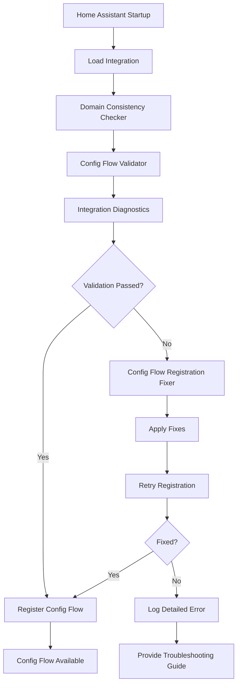
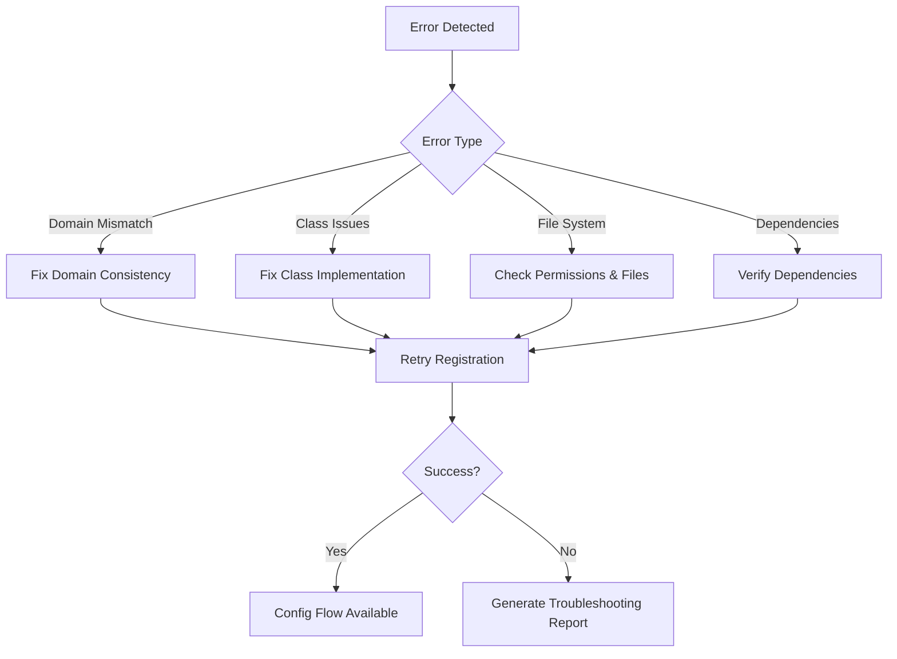

# Config Flow Handler Fix - Design Document

## Overview

This design addresses the "Config flow could not be loaded: Invalid handler specified" error by implementing comprehensive validation and fixing of the config flow registration system. The solution focuses on ensuring proper domain consistency, config flow class registration, and integration initialization robustness.

## Architecture

### Core Components

1. **Config Flow Validator** - Validates config flow registration and domain consistency
2. **Integration Diagnostics** - Provides detailed diagnostic information for troubleshooting
3. **Domain Consistency Checker** - Ensures domain configuration is consistent across all files
4. **Config Flow Registration Fixer** - Automatically fixes common config flow registration issues
5. **Startup Validation System** - Validates integration components during startup

### Component Interaction Flow



## Components and Interfaces

### 1. Config Flow Validator

**Purpose:** Validates that the config flow is properly configured and can be registered.

**Interface:**
```python
class ConfigFlowValidator:
    def __init__(self, hass: HomeAssistant, domain: str)
    async def validate_config_flow_registration(self) -> ValidationResult
    async def validate_domain_consistency(self) -> ValidationResult
    async def validate_manifest_configuration(self) -> ValidationResult
    async def validate_class_implementation(self) -> ValidationResult
    def get_validation_report(self) -> Dict[str, Any]
```

**Key Methods:**
- `validate_config_flow_registration()` - Checks if config flow can be properly registered
- `validate_domain_consistency()` - Ensures domain is consistent across all files
- `validate_manifest_configuration()` - Validates manifest.json configuration
- `validate_class_implementation()` - Checks config flow class implementation

### 2. Integration Diagnostics

**Purpose:** Provides comprehensive diagnostic information for troubleshooting config flow issues.

**Interface:**
```python
class IntegrationDiagnostics:
    def __init__(self, hass: HomeAssistant, domain: str)
    async def collect_diagnostic_data(self) -> DiagnosticData
    async def check_file_permissions(self) -> PermissionStatus
    async def verify_dependencies(self) -> DependencyStatus
    async def validate_imports(self) -> ImportStatus
    def generate_troubleshooting_report(self) -> str
```

**Key Methods:**
- `collect_diagnostic_data()` - Gathers comprehensive system information
- `check_file_permissions()` - Validates file system permissions
- `verify_dependencies()` - Checks all required dependencies
- `validate_imports()` - Tests all Python imports

### 3. Domain Consistency Checker

**Purpose:** Ensures the domain is consistently defined across all integration files.

**Interface:**
```python
class DomainConsistencyChecker:
    def __init__(self, integration_path: str)
    async def check_manifest_domain(self) -> str
    async def check_const_domain(self) -> str
    async def check_config_flow_domain(self) -> str
    async def validate_consistency(self) -> ConsistencyResult
    async def fix_inconsistencies(self) -> FixResult
```

**Key Methods:**
- `check_manifest_domain()` - Extracts domain from manifest.json
- `check_const_domain()` - Extracts domain from const.py
- `check_config_flow_domain()` - Extracts domain from config flow class
- `validate_consistency()` - Checks for domain mismatches
- `fix_inconsistencies()` - Automatically fixes domain inconsistencies

### 4. Config Flow Registration Fixer

**Purpose:** Automatically fixes common config flow registration issues.

**Interface:**
```python
class ConfigFlowRegistrationFixer:
    def __init__(self, hass: HomeAssistant, domain: str)
    async def diagnose_registration_issues(self) -> List[RegistrationIssue]
    async def fix_domain_mismatch(self) -> FixResult
    async def fix_class_inheritance(self) -> FixResult
    async def fix_method_implementation(self) -> FixResult
    async def apply_all_fixes(self) -> OverallFixResult
```

**Key Methods:**
- `diagnose_registration_issues()` - Identifies specific registration problems
- `fix_domain_mismatch()` - Fixes domain configuration issues
- `fix_class_inheritance()` - Ensures proper config flow class inheritance
- `fix_method_implementation()` - Fixes missing or incorrect methods

### 5. Startup Validation System

**Purpose:** Validates integration components during Home Assistant startup.

**Interface:**
```python
class StartupValidationSystem:
    def __init__(self, hass: HomeAssistant)
    async def validate_integration_loading(self, domain: str) -> ValidationResult
    async def validate_config_flow_availability(self, domain: str) -> ValidationResult
    async def run_comprehensive_validation(self, domain: str) -> ComprehensiveResult
    def get_startup_diagnostics(self) -> Dict[str, Any]
```

**Key Methods:**
- `validate_integration_loading()` - Checks if integration loads properly
- `validate_config_flow_availability()` - Verifies config flow is available
- `run_comprehensive_validation()` - Runs all validation checks
- `get_startup_diagnostics()` - Provides startup diagnostic information

## Data Models

### ValidationResult
```python
@dataclass
class ValidationResult:
    success: bool
    issues: List[ValidationIssue]
    warnings: List[str]
    recommendations: List[str]
    diagnostic_data: Dict[str, Any]
```

### RegistrationIssue
```python
@dataclass
class RegistrationIssue:
    issue_type: str
    description: str
    severity: str
    fix_available: bool
    fix_description: str
    diagnostic_info: Dict[str, Any]
```

### DiagnosticData
```python
@dataclass
class DiagnosticData:
    ha_version: str
    integration_version: str
    domain_consistency: bool
    file_permissions: Dict[str, bool]
    import_status: Dict[str, bool]
    dependency_status: Dict[str, bool]
    config_flow_class_found: bool
    manifest_valid: bool
    error_details: List[str]
```

## Error Handling

### Error Categories

1. **Domain Mismatch Errors**
   - Manifest domain != const.py domain
   - Config flow domain != manifest domain
   - Service registration domain mismatch

2. **Class Implementation Errors**
   - Config flow class not found
   - Incorrect inheritance
   - Missing required methods

3. **File System Errors**
   - Missing files
   - Permission issues
   - Corrupted files

4. **Dependency Errors**
   - Missing Home Assistant components
   - Import failures
   - Version incompatibilities

### Error Recovery Strategy



### Specific Error Handlers

1. **Domain Mismatch Handler**
   - Detects inconsistent domain definitions
   - Automatically updates const.py if needed
   - Validates manifest.json format

2. **Import Error Handler**
   - Identifies missing imports
   - Checks circular import issues
   - Validates Python path configuration

3. **Permission Error Handler**
   - Checks file readability
   - Validates directory permissions
   - Provides permission fix guidance

## Testing Strategy

### Unit Tests

1. **Config Flow Validator Tests**
   - Test domain consistency validation
   - Test manifest configuration validation
   - Test class implementation validation

2. **Integration Diagnostics Tests**
   - Test diagnostic data collection
   - Test permission checking
   - Test dependency verification

3. **Domain Consistency Checker Tests**
   - Test domain extraction from files
   - Test consistency validation
   - Test automatic fixing

### Integration Tests

1. **End-to-End Config Flow Tests**
   - Test complete config flow registration
   - Test error recovery scenarios
   - Test fix application

2. **Startup Validation Tests**
   - Test integration loading validation
   - Test comprehensive validation
   - Test diagnostic reporting

### Error Scenario Tests

1. **Domain Mismatch Scenarios**
   - Manifest domain != const domain
   - Config flow domain mismatch
   - Service registration issues

2. **File System Issue Scenarios**
   - Missing files
   - Permission problems
   - Corrupted configurations

3. **Dependency Issue Scenarios**
   - Missing Home Assistant components
   - Import failures
   - Version conflicts

## Implementation Approach

### Phase 1: Diagnostic and Validation Infrastructure
1. Implement Config Flow Validator
2. Implement Integration Diagnostics
3. Implement Domain Consistency Checker
4. Add comprehensive logging

### Phase 2: Automatic Fixing System
1. Implement Config Flow Registration Fixer
2. Add automatic domain consistency fixing
3. Implement error recovery mechanisms
4. Add fix verification

### Phase 3: Startup Integration
1. Implement Startup Validation System
2. Integrate validation into __init__.py
3. Add startup diagnostic reporting
4. Implement graceful error handling

### Phase 4: Testing and Validation
1. Implement comprehensive test suite
2. Test error scenarios
3. Validate fix effectiveness
4. Performance optimization

## Configuration Integration

### Integration with Existing Code

The validation system will be integrated into the existing `__init__.py` file:

```python
async def async_setup_entry(hass: HomeAssistant, entry: ConfigEntry) -> bool:
    """Set up with validation."""
    # Run startup validation
    validator = StartupValidationSystem(hass)
    validation_result = await validator.run_comprehensive_validation(DOMAIN)
    
    if not validation_result.success:
        # Apply fixes if possible
        fixer = ConfigFlowRegistrationFixer(hass, DOMAIN)
        fix_result = await fixer.apply_all_fixes()
        
        if not fix_result.success:
            # Generate troubleshooting report
            diagnostics = IntegrationDiagnostics(hass, DOMAIN)
            report = diagnostics.generate_troubleshooting_report()
            _LOGGER.error("Config flow registration failed: %s", report)
            return False
    
    # Continue with normal setup...
```

### Configuration Options

The system will support configuration options for:
- Validation strictness level
- Automatic fixing enabled/disabled
- Diagnostic detail level
- Error reporting preferences

## Performance Considerations

### Validation Performance
- Validation runs only during startup
- Caching of validation results
- Minimal impact on normal operation
- Async implementation for non-blocking execution

### Memory Usage
- Lightweight diagnostic data structures
- Cleanup of temporary validation data
- Efficient error reporting

### Startup Time Impact
- Validation adds minimal startup time
- Parallel validation where possible
- Early exit on successful validation
- Cached results for repeated checks

## Security Considerations

### File System Access
- Read-only access to integration files
- No modification of system files
- Secure path validation
- Permission checking before file access

### Error Information
- Sanitized error messages
- No sensitive information in logs
- Secure diagnostic data collection
- Privacy-conscious troubleshooting reports