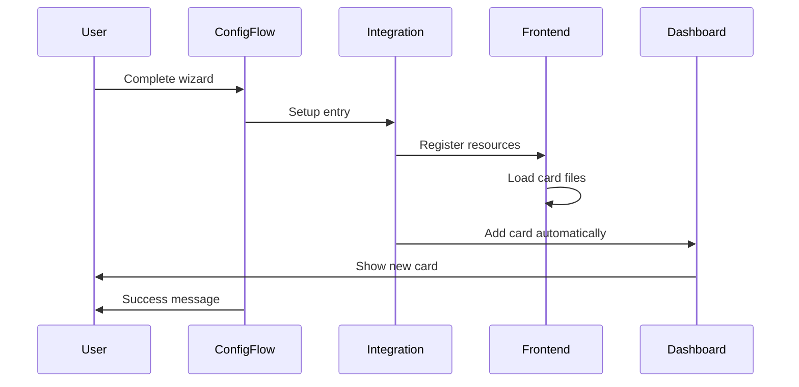

# Design Document

## Overview

The dashboard card integration feature addresses the missing link between successful Roost Scheduler configuration and immediate dashboard availability. Currently, the integration has a custom Lovelace card implementation, but it's not properly registered with Home Assistant's frontend system, making it invisible to users after configuration.

The solution involves implementing proper frontend resource registration during integration setup, automatic card installation during the configuration flow, and robust error handling to ensure users can always access the scheduling interface.

## Architecture

### Component Interaction Flow



### Frontend Resource Registration

The integration will register frontend resources during the `async_setup_entry` phase, ensuring the card JavaScript files are loaded and available to Home Assistant's frontend system.

### Automatic Card Installation

During the configuration flow completion, the system will automatically add a Roost Scheduler card to the user's default dashboard with sensible default settings.

## Components and Interfaces

### 1. Frontend Resource Manager

**Purpose:** Handle registration and loading of frontend resources (JavaScript, CSS)

**Key Methods:**
- `register_frontend_resources()`: Register card files with Home Assistant
- `verify_resource_availability()`: Check if card files exist and are accessible
- `handle_resource_loading_errors()`: Manage fallback scenarios

**Integration Points:**
- Called during `async_setup_entry` in `__init__.py`
- Integrates with Home Assistant's `frontend.add_extra_js_url()` API
- Monitors file system for card resource availability

### 2. Dashboard Integration Service

**Purpose:** Automatically add cards to user dashboards and manage dashboard interactions

**Key Methods:**
- `add_card_to_dashboard()`: Add Roost Scheduler card to specified dashboard
- `get_default_dashboard()`: Identify the user's primary dashboard
- `create_default_card_config()`: Generate sensible default card configuration
- `handle_dashboard_conflicts()`: Manage existing card conflicts

**Integration Points:**
- Called from configuration flow after successful setup
- Uses Home Assistant's Lovelace storage API
- Integrates with existing `_install_lovelace_card()` method in config flow

### 3. Card Registration Handler

**Purpose:** Ensure the custom card is properly registered with Home Assistant's card picker

**Key Methods:**
- `register_custom_card()`: Register card with Home Assistant's card system
- `verify_card_registration()`: Confirm card appears in picker
- `handle_registration_failures()`: Manage registration error scenarios

**Integration Points:**
- Extends existing card registration in `roost-scheduler-card.ts`
- Integrates with Home Assistant's custom card discovery system
- Provides feedback to configuration flow about registration status

### 4. Setup Diagnostics and Feedback

**Purpose:** Provide clear feedback about dashboard integration status

**Key Methods:**
- `generate_setup_summary()`: Create user-friendly setup completion message
- `create_troubleshooting_info()`: Generate diagnostic information for failures
- `provide_next_steps()`: Guide users to their new card

**Integration Points:**
- Integrates with existing setup diagnostics in `__init__.py`
- Provides feedback through configuration flow UI
- Logs detailed information for troubleshooting

## Data Models

### Frontend Resource Configuration

```python
@dataclass
class FrontendResourceConfig:
    """Configuration for frontend resource registration."""
    card_js_path: str
    card_css_path: Optional[str]
    resource_version: str
    fallback_enabled: bool
    retry_attempts: int
```

### Dashboard Card Configuration

```python
@dataclass
class DashboardCardConfig:
    """Configuration for automatic card installation."""
    dashboard_id: str
    view_id: Optional[str]
    card_position: Optional[int]
    default_entity: Optional[str]
    card_settings: Dict[str, Any]
```

### Integration Status

```python
@dataclass
class DashboardIntegrationStatus:
    """Status of dashboard integration process."""
    resources_registered: bool
    card_available_in_picker: bool
    card_added_to_dashboard: bool
    dashboard_id: Optional[str]
    error_messages: List[str]
    next_steps: List[str]
```

## Error Handling

### Resource Loading Failures

**Scenario:** Card JavaScript files are missing or corrupted
**Handling:** 
- Log detailed error with file paths and permissions
- Attempt to regenerate or download resources if possible
- Provide clear user message about manual card installation
- Continue integration setup without failing completely

### Dashboard Access Failures

**Scenario:** Cannot access or modify user's dashboard configuration
**Handling:**
- Fall back to ensuring card is available in picker only
- Log specific dashboard access errors
- Provide manual installation instructions
- Offer alternative dashboard options if available

### Card Registration Failures

**Scenario:** Custom card doesn't appear in Home Assistant's card picker
**Handling:**
- Retry registration with different approaches
- Verify Home Assistant version compatibility
- Check for conflicting card registrations
- Provide troubleshooting steps for manual registration

### Version Compatibility Issues

**Scenario:** Home Assistant version doesn't support required frontend APIs
**Handling:**
- Detect Home Assistant version during setup
- Use appropriate API methods for detected version
- Gracefully degrade functionality for older versions
- Warn users about limited functionality

## Testing Strategy

### Unit Tests

1. **Frontend Resource Registration Tests**
   - Test successful resource registration
   - Test handling of missing card files
   - Test retry logic for failed registrations
   - Test version compatibility checks

2. **Dashboard Integration Tests**
   - Test automatic card addition to default dashboard
   - Test handling of dashboard access failures
   - Test card configuration generation
   - Test conflict resolution with existing cards

3. **Card Registration Tests**
   - Test custom card registration with Home Assistant
   - Test card picker availability verification
   - Test registration failure recovery
   - Test multiple integration instance handling

### Integration Tests

1. **End-to-End Configuration Flow Tests**
   - Test complete wizard flow with automatic card installation
   - Test configuration flow with dashboard integration failures
   - Test user feedback and error message display
   - Test next steps guidance after setup completion

2. **Cross-Version Compatibility Tests**
   - Test integration with different Home Assistant versions
   - Test frontend API compatibility across versions
   - Test graceful degradation for unsupported features
   - Test upgrade scenarios from older versions

3. **Real Dashboard Tests**
   - Test card installation on various dashboard configurations
   - Test card functionality after automatic installation
   - Test card editor availability and functionality
   - Test card removal and reinstallation scenarios

### Error Scenario Tests

1. **Resource Failure Tests**
   - Test behavior with missing card JavaScript files
   - Test behavior with corrupted card resources
   - Test behavior with insufficient file permissions
   - Test recovery after resource restoration

2. **Dashboard Failure Tests**
   - Test behavior with read-only dashboard configurations
   - Test behavior with corrupted dashboard storage
   - Test behavior with multiple dashboard conflicts
   - Test behavior with insufficient dashboard permissions

3. **Network and Timing Tests**
   - Test behavior during Home Assistant startup delays
   - Test behavior with slow frontend resource loading
   - Test behavior with concurrent integration setups
   - Test behavior during Home Assistant restarts

## Implementation Phases

### Phase 1: Frontend Resource Registration
- Implement `FrontendResourceManager` class
- Add resource registration to `async_setup_entry`
- Add resource verification and error handling
- Update integration diagnostics to include resource status

### Phase 2: Automatic Card Installation
- Enhance existing `_install_lovelace_card` method
- Add automatic card installation to configuration flow
- Implement default card configuration generation
- Add dashboard conflict resolution

### Phase 3: Card Registration Enhancement
- Improve card registration in TypeScript code
- Add registration verification and retry logic
- Implement card picker availability checks
- Add registration status feedback

### Phase 4: User Feedback and Diagnostics
- Implement setup completion feedback system
- Add troubleshooting information generation
- Create next steps guidance for users
- Enhance error messages with actionable information

Each phase builds incrementally on the previous phase, ensuring that core functionality is established before adding advanced features.