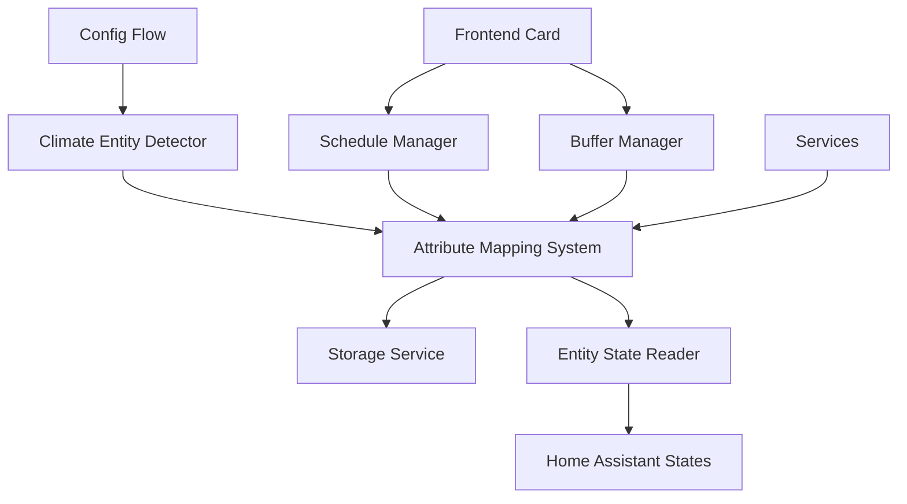

# Enhanced Climate Entity Support - Design Document

## Overview

This design document outlines the implementation approach for supporting climate entities with flexible temperature attribute naming, specifically targeting Zigbee2MQTT and other integrations that use `current_temperature` instead of the standard `temperature` attribute.

## Architecture

### Core Components

1. **Climate Entity Detector**: New utility class for flexible temperature attribute detection
2. **Enhanced Config Flow**: Updated entity discovery and validation logic
3. **Attribute Mapping System**: Storage and retrieval of entity-specific attribute mappings
4. **Buffer System Updates**: Enhanced current value detection using correct attributes
5. **Service Layer Updates**: Updated validation and value retrieval logic
6. **Frontend Integration**: Card updates for flexible temperature display

### Component Interactions



## Components and Interfaces

### Climate Entity Detector

**Purpose**: Centralized logic for detecting and validating climate entities with flexible temperature attribute support.

**Interface**:
```python
class ClimateEntityDetector:
    """Detects and validates climate entities with flexible attribute support."""
    
    TEMPERATURE_ATTRIBUTES = [
        "temperature",        # Standard HA climate
        "current_temperature", # Z2M and others
        "current_temp",       # Alternative naming
    ]
    
    async def detect_temperature_attribute(self, entity_id: str) -> Optional[str]
    async def validate_climate_entity(self, entity_id: str) -> Dict[str, Any]
    async def get_current_temperature(self, entity_id: str) -> Optional[float]
    def is_climate_entity_supported(self, state: State) -> Tuple[bool, str, Optional[str]]
```

**Key Methods**:
- `detect_temperature_attribute()`: Returns the first available temperature attribute
- `validate_climate_entity()`: Comprehensive validation with attribute detection
- `get_current_temperature()`: Retrieves temperature using the correct attribute
- `is_climate_entity_supported()`: Enhanced support check with attribute info

### Attribute Mapping System

**Purpose**: Stores and manages entity-specific attribute mappings for consistent access.

**Interface**:
```python
class AttributeMappingManager:
    """Manages entity-specific attribute mappings."""
    
    def __init__(self, storage_service: StorageService)
    
    async def store_entity_mapping(self, entity_id: str, temperature_attr: str) -> None
    async def get_entity_mapping(self, entity_id: str) -> Optional[str]
    async def update_entity_mappings(self, entity_mappings: Dict[str, str]) -> None
    async def remove_entity_mapping(self, entity_id: str) -> None
    async def get_all_mappings(self) -> Dict[str, str]
```

**Storage Format**:
```json
{
  "entity_attribute_mappings": {
    "climate.nest_thermostat": "temperature",
    "climate.zigbee_thermostat": "current_temperature",
    "climate.z2m_radiator": "current_temperature"
  }
}
```

### Enhanced Config Flow

**Updates to Existing Flow**:

1. **Entity Discovery Enhancement**:
   - Use `ClimateEntityDetector` for entity scanning
   - Store detected attribute mappings during setup
   - Provide detailed entity information in UI

2. **Validation Updates**:
   - Enhanced `_is_climate_entity_supported()` method
   - Better error messages for unsupported entities
   - Attribute detection logging

3. **Setup Data Enhancement**:
   - Include attribute mappings in config entry data
   - Store mappings for future reference

### Buffer Manager Updates

**Enhanced Current Value Detection**:

```python
async def get_current_temperature(self, entity_id: str) -> Optional[float]:
    """Get current temperature using the correct attribute for the entity."""
    # Get the correct temperature attribute for this entity
    temp_attr = await self.attribute_manager.get_entity_mapping(entity_id)
    
    if not temp_attr:
        # Fallback to detection if not stored
        temp_attr = await self.climate_detector.detect_temperature_attribute(entity_id)
        if temp_attr:
            await self.attribute_manager.store_entity_mapping(entity_id, temp_attr)
    
    if temp_attr:
        entity_state = self.hass.states.get(entity_id)
        if entity_state:
            return entity_state.attributes.get(temp_attr)
    
    return None
```

### Schedule Manager Updates

**Enhanced Entity Value Application**:

1. **Current Value Reading**: Use attribute mapping for accurate current temperature
2. **Validation Updates**: Use enhanced climate entity detector
3. **Logging Enhancement**: Include attribute information in debug logs

### Service Layer Updates

**Enhanced Service Validation**:

1. **Entity Compatibility**: Use new validation logic
2. **Current Value Retrieval**: Use correct temperature attributes
3. **Error Reporting**: Provide specific attribute-related error messages

## Data Models

### Enhanced Schedule Data

**Addition to Existing ScheduleData Model**:

```python
@dataclass
class ScheduleData:
    # ... existing fields ...
    
    # New field for entity attribute mappings
    entity_attribute_mappings: Dict[str, str] = field(default_factory=dict)
```

### Entity Validation Result

**New Model for Enhanced Validation**:

```python
@dataclass
class EntityValidationResult:
    """Result of climate entity validation."""
    entity_id: str
    compatible: bool
    reason: Optional[str] = None
    temperature_attribute: Optional[str] = None
    current_temperature: Optional[float] = None
    min_temp: Optional[float] = None
    max_temp: Optional[float] = None
    supported_features: Optional[int] = None
```

## Error Handling

### Enhanced Error Messages

1. **Missing Temperature Attributes**:
   ```
   Climate entity 'climate.zigbee_thermostat' is not supported: 
   No recognized temperature attribute found. 
   Checked: temperature, current_temperature, current_temp
   ```

2. **Attribute Detection Issues**:
   ```
   Warning: Entity 'climate.unknown_thermostat' uses non-standard 
   temperature attribute 'temp_current'. Consider reporting this 
   to the integration maintainer.
   ```

3. **Migration Warnings**:
   ```
   Info: Updated temperature attribute mapping for 'climate.z2m_thermostat' 
   from 'temperature' to 'current_temperature' during migration.
   ```

### Fallback Strategies

1. **Attribute Detection Failure**: Fall back to standard `temperature` attribute
2. **Mapping Storage Failure**: Continue with runtime detection
3. **Migration Issues**: Preserve existing functionality, log warnings

## Testing Strategy

### Unit Tests

1. **Climate Entity Detector Tests**:
   - Test attribute detection with various entity configurations
   - Test validation logic with different attribute combinations
   - Test error handling for unsupported entities

2. **Attribute Mapping Tests**:
   - Test storage and retrieval of mappings
   - Test migration of existing configurations
   - Test cleanup of obsolete mappings

3. **Integration Tests**:
   - Test config flow with mixed entity types
   - Test buffer system with different temperature attributes
   - Test service calls with enhanced validation

### Test Data Scenarios

1. **Standard Climate Entities**: Entities with `temperature` attribute
2. **Z2M Climate Entities**: Entities with `current_temperature` attribute
3. **Mixed Environments**: Both types in the same installation
4. **Edge Cases**: Entities with multiple temperature attributes
5. **Unsupported Entities**: Entities with no recognized temperature attributes

## Migration Strategy

### Automatic Migration

1. **Existing Installations**:
   - Re-scan all configured climate entities
   - Detect and store appropriate temperature attributes
   - Update entity configurations without user intervention

2. **Data Structure Updates**:
   - Add `entity_attribute_mappings` to existing schedule data
   - Preserve all existing schedule configurations
   - Maintain backward compatibility

### Migration Process

```python
async def migrate_entity_attributes(self) -> None:
    """Migrate existing entities to use attribute mappings."""
    
    # Get all currently tracked entities
    tracked_entities = self.schedule_data.entities_tracked
    
    # Detect temperature attributes for each entity
    mappings = {}
    for entity_id in tracked_entities:
        temp_attr = await self.climate_detector.detect_temperature_attribute(entity_id)
        if temp_attr:
            mappings[entity_id] = temp_attr
    
    # Store the mappings
    await self.attribute_manager.update_entity_mappings(mappings)
    
    # Update schedule data
    self.schedule_data.entity_attribute_mappings = mappings
    await self.storage_service.save_schedules(self.schedule_data)
```

## Performance Considerations

### Optimization Strategies

1. **Caching**: Cache attribute mappings to avoid repeated detection
2. **Lazy Loading**: Only detect attributes when needed
3. **Batch Operations**: Process multiple entities efficiently during setup
4. **State Monitoring**: Monitor entity state changes for attribute updates

### Performance Metrics

1. **Setup Time**: Measure impact on config flow performance
2. **Runtime Overhead**: Monitor additional processing time for attribute lookup
3. **Memory Usage**: Track memory impact of attribute mapping storage
4. **State Access**: Optimize frequency of Home Assistant state access

## Security Considerations

### Data Validation

1. **Attribute Name Validation**: Ensure attribute names are safe strings
2. **Entity ID Validation**: Validate entity IDs before storage
3. **State Access Security**: Use proper Home Assistant state access patterns

### Privacy Considerations

1. **Entity Information**: Attribute mappings contain only technical metadata
2. **Storage Security**: Use Home Assistant's secure storage mechanisms
3. **Logging Privacy**: Avoid logging sensitive temperature values in debug mode

## Deployment Strategy

### Rollout Plan

1. **Phase 1**: Core detection and mapping system
2. **Phase 2**: Config flow and validation updates
3. **Phase 3**: Buffer and schedule manager integration
4. **Phase 4**: Service layer and frontend updates
5. **Phase 5**: Migration and cleanup tools

### Compatibility Matrix

| Component | Standard Entities | Z2M Entities | Mixed Environment |
|-----------|------------------|--------------|-------------------|
| Config Flow | ✅ Compatible | ✅ Enhanced | ✅ Full Support |
| Schedule Manager | ✅ Compatible | ✅ Enhanced | ✅ Full Support |
| Buffer System | ✅ Compatible | ✅ Enhanced | ✅ Full Support |
| Services | ✅ Compatible | ✅ Enhanced | ✅ Full Support |
| Frontend Card | ✅ Compatible | ✅ Enhanced | ✅ Full Support |

### Rollback Strategy

1. **Configuration Preservation**: Keep original configurations as backup
2. **Graceful Degradation**: Fall back to standard behavior if enhanced features fail
3. **Migration Reversal**: Ability to revert attribute mappings if needed
4. **Error Recovery**: Automatic recovery from attribute detection failures