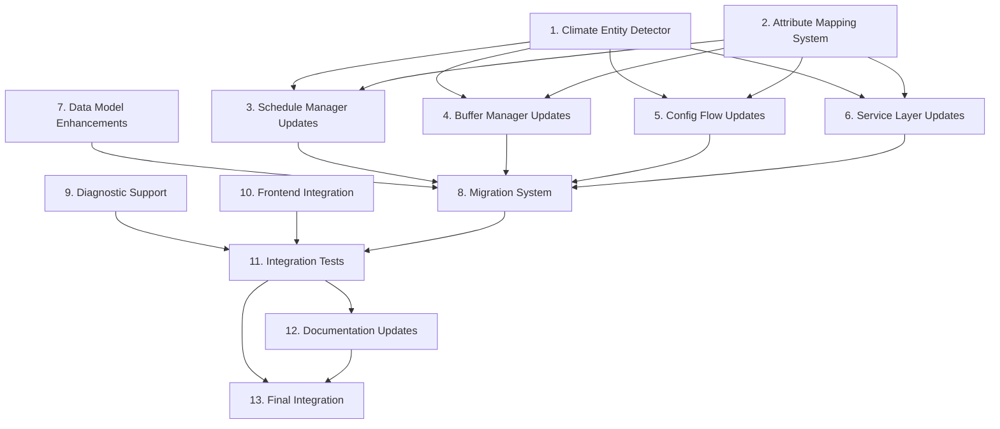

# Enhanced Climate Entity Support - Implementation Plan

Convert the enhanced climate entity support design into a series of prompts for a code-generation LLM that will implement each step in a test-driven manner. Prioritize best practices, incremental progress, and early testing, ensuring no big jumps in complexity at any stage. Make sure that each prompt builds on the previous prompts, and ends with wiring things together. There should be no hanging or orphaned code that isn't integrated into a previous step. Focus ONLY on tasks that involve writing, modifying, or testing code.

## Implementation Tasks

- [ ] 1. Create Climate Entity Detector utility class
  - Create new `climate_detector.py` module with `ClimateEntityDetector` class
  - Implement temperature attribute detection with priority order (temperature, current_temperature, current_temp)
  - Add comprehensive validation logic for climate entities
  - Write unit tests covering all attribute detection scenarios
  - Test with mock entities having different temperature attribute configurations
  - Commit changes with descriptive commit message
  - _Requirements: 1.1, 1.2, 1.3, 1.4_

- [ ] 2. Implement Attribute Mapping System
  - Create `AttributeMappingManager` class in new `attribute_mapping.py` module
  - Implement storage and retrieval of entity-specific temperature attribute mappings
  - Add methods for storing, retrieving, updating, and removing entity mappings
  - Integrate with existing storage service for persistence
  - Write unit tests for all mapping operations and edge cases
  - Commit changes with descriptive commit message
  - _Requirements: 1.4, 3.2, 8.2_

- [ ] 3. Enhance Schedule Manager with flexible temperature support
  - Update `ScheduleManager` to use `ClimateEntityDetector` for entity validation
  - Integrate `AttributeMappingManager` for consistent temperature attribute access
  - Modify `validate_entity_compatibility` method to use enhanced detection
  - Update current temperature retrieval methods to use correct attributes
  - Add comprehensive logging for attribute detection and usage
  - Write unit tests for enhanced schedule manager functionality
  - Commit changes with descriptive commit message
  - _Requirements: 2.3, 4.1, 4.2, 7.1, 7.2_

- [ ] 4. Update Buffer Manager for flexible temperature attributes
  - Modify `BufferManager` to use attribute mappings for current value detection
  - Update `get_current_temperature` method to use entity-specific attributes
  - Enhance buffer decision logging to include temperature attribute information
  - Update manual change detection to monitor correct temperature attributes
  - Write unit tests for buffer manager with mixed entity types
  - Commit changes with descriptive commit message
  - _Requirements: 4.1, 4.2, 4.3, 4.4_

- [ ] 5. Enhance Config Flow with improved entity discovery
  - Update `_get_climate_entities` method to use `ClimateEntityDetector`
  - Modify `_is_climate_entity_supported` to use enhanced validation logic
  - Store detected attribute mappings during config flow setup
  - Enhance entity display in UI with temperature attribute information
  - Add better error messages for unsupported entities
  - Write unit tests for enhanced config flow functionality
  - Commit changes with descriptive commit message
  - _Requirements: 2.1, 2.2, 2.3, 2.4_

- [ ] 6. Update Service Layer with enhanced validation
  - Modify service validation methods to use `ClimateEntityDetector`
  - Update `apply_slot_service` and `apply_grid_now_service` for flexible attributes
  - Enhance error reporting with specific attribute-related messages
  - Update service parameter validation to work with all supported entity types
  - Write unit tests for service layer with mixed entity configurations
  - Commit changes with descriptive commit message
  - _Requirements: 5.1, 5.2, 5.3, 5.4_

- [ ] 7. Implement data model enhancements
  - Add `entity_attribute_mappings` field to `ScheduleData` model
  - Create `EntityValidationResult` dataclass for enhanced validation results
  - Update model serialization/deserialization to handle new fields
  - Ensure backward compatibility with existing schedule data
  - Write unit tests for enhanced data models
  - Commit changes with descriptive commit message
  - _Requirements: 3.2, 8.1_

- [ ] 8. Create migration system for existing installations
  - Implement automatic detection and mapping of existing climate entities
  - Create migration function to update existing schedule data with attribute mappings
  - Add migration validation and error handling
  - Ensure migration preserves all existing schedule configurations
  - Write unit tests for migration scenarios with various entity configurations
  - Commit changes with descriptive commit message
  - _Requirements: 3.1, 3.2, 8.1, 8.2, 8.3, 8.4_

- [ ] 9. Add diagnostic and troubleshooting support
  - Create diagnostic service to report temperature attribute usage for all entities
  - Add debug logging throughout the system with attribute information
  - Implement health check functionality for attribute mapping consistency
  - Create troubleshooting utilities for attribute detection issues
  - Write unit tests for diagnostic functionality
  - Commit changes with descriptive commit message
  - _Requirements: 7.1, 7.2, 7.3, 7.4_

- [ ] 10. Update Frontend Card integration
  - Modify card backend services to use correct temperature attributes
  - Update WebSocket handlers to provide temperature attribute information
  - Enhance real-time temperature monitoring for mixed entity types
  - Add error handling and display for unsupported entities in card
  - Write unit tests for frontend integration with mixed entity types
  - Commit changes with descriptive commit message
  - _Requirements: 6.1, 6.2, 6.3, 6.4_

- [ ] 11. Create comprehensive integration tests
  - Write integration tests for mixed entity environments (standard + Z2M)
  - Test complete workflows from setup to schedule application
  - Test migration scenarios from existing installations
  - Test error handling and recovery for various failure modes
  - Validate backward compatibility with existing configurations
  - Commit changes with descriptive commit message
  - _Requirements: All requirements validation_

- [ ] 12. Update documentation and user guides
  - Update SETUP_GUIDE.md with information about supported entity types
  - Add troubleshooting section for temperature attribute issues
  - Document the migration process for existing users
  - Add examples of supported entity configurations
  - Create diagnostic guide for temperature attribute problems
  - Commit changes with descriptive commit message
  - _Requirements: 7.3, 7.4_

- [ ] 13. Final integration and testing
  - Integrate all components with proper error handling
  - Perform end-to-end testing with real Z2M climate entities
  - Validate performance impact of enhanced attribute detection
  - Test rollback scenarios and error recovery
  - Create final validation tests for all requirements
  - git add and git commit to allow for rollback
  - _Requirements: All requirements final validation_

## Task Dependencies

## Implementation Notes

### Priority Order
1. **Core Infrastructure** (Tasks 1-2): Foundation components that other tasks depend on
2. **Component Integration** (Tasks 3-6): Update existing components to use new infrastructure
3. **Data and Migration** (Tasks 7-8): Handle data model changes and existing installation migration
4. **User Experience** (Tasks 9-10): Diagnostics and frontend improvements
5. **Validation and Documentation** (Tasks 11-13): Comprehensive testing and user guidance

### Testing Strategy
- Each task includes comprehensive unit tests
- Integration tests validate component interactions
- Migration tests ensure backward compatibility
- Performance tests validate no significant overhead
- Real-world testing with actual Z2M devices

### Rollback Safety
- Each task includes git commits for rollback points
- Migration includes backup and recovery mechanisms
- Graceful degradation if enhanced features fail
- Preservation of existing functionality throughout

### Code Quality Standards
- Follow existing code style and patterns
- Comprehensive error handling and logging
- Clear documentation and type hints
- Performance considerations for all changes
- Security validation for all new data handling