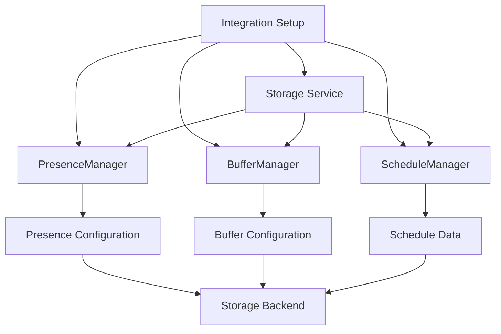

# Manager Integration Fix - Design Document

## Overview

This design document addresses the critical integration issue where PresenceManager and BufferManager constructors don't match the parameters being passed during integration setup, causing setup failures. The solution involves updating both managers to properly integrate with the storage service for configuration persistence.

## Root Cause Analysis

### Current Issue
```python
# In __init__.py - what's being called:
presence_manager = PresenceManager(hass, storage_service)  # 3 arguments
buffer_manager = BufferManager(hass, storage_service)     # 3 arguments

# In presence_manager.py - what's expected:
def __init__(self, hass: HomeAssistant) -> None:          # 2 arguments only

# In buffer_manager.py - what's expected:
def __init__(self, hass: HomeAssistant) -> None:          # 2 arguments only
```

### Impact
- Integration setup fails with TypeError
- Users cannot configure presence detection
- Buffer settings are not persisted
- No graceful error handling for storage issues

## Architecture

### Updated Component Structure



### Configuration Storage Structure

```json
{
  "version": "0.3.0",
  "entities_tracked": ["climate.living_room"],
  "presence_config": {
    "entities": ["device_tracker.phone", "person.user"],
    "rule": "anyone_home",
    "timeout_seconds": 600,
    "override_entities": {
      "force_home": "input_boolean.roost_force_home",
      "force_away": "input_boolean.roost_force_away"
    },
    "custom_template": null,
    "template_entities": []
  },
  "buffer_config": {
    "global": {
      "time_minutes": 15,
      "value_delta": 2.0,
      "enabled": true,
      "apply_to": "climate"
    },
    "entity_overrides": {}
  },
  "schedules": {
    "home": {},
    "away": {}
  }
}
```

## Components and Interfaces

### Enhanced PresenceManager

**Updated Constructor**:
```python
class PresenceManager:
    def __init__(self, hass: HomeAssistant, storage_service: StorageService) -> None:
        """Initialize the presence manager with storage integration."""
        self.hass = hass
        self.storage_service = storage_service
        self._presence_entities: List[str] = []
        self._presence_rule = "anyone_home"
        self._timeout_seconds = DEFAULT_PRESENCE_TIMEOUT_SECONDS
        # ... other initialization
```

**New Methods**:
```python
async def load_configuration(self) -> None:
    """Load presence configuration from storage."""

async def save_configuration(self) -> None:
    """Save presence configuration to storage."""

async def update_presence_entities(self, entities: List[str]) -> None:
    """Update presence entities and persist to storage."""

async def update_presence_rule(self, rule: str) -> None:
    """Update presence rule and persist to storage."""

def get_configuration_summary(self) -> Dict[str, Any]:
    """Get current configuration for diagnostics."""
```

### Enhanced BufferManager

**Updated Constructor**:
```python
class BufferManager:
    def __init__(self, hass: HomeAssistant, storage_service: StorageService) -> None:
        """Initialize the buffer manager with storage integration."""
        self.hass = hass
        self.storage_service = storage_service
        self._entity_states: Dict[str, EntityState] = {}
        self._global_buffer = BufferConfig()  # Will be loaded from storage
        # ... other initialization
```

**New Methods**:
```python
async def load_configuration(self) -> None:
    """Load buffer configuration from storage."""

async def save_configuration(self) -> None:
    """Save buffer configuration to storage."""

async def update_global_buffer_config(self, config: BufferConfig) -> None:
    """Update global buffer configuration and persist to storage."""

async def update_entity_buffer_config(self, entity_id: str, config: BufferConfig) -> None:
    """Update entity-specific buffer configuration and persist to storage."""

def get_configuration_summary(self) -> Dict[str, Any]:
    """Get current configuration for diagnostics."""
```

### Configuration Data Models

**PresenceConfig**:
```python
@dataclass
class PresenceConfig:
    """Configuration for presence detection."""
    entities: List[str] = field(default_factory=list)
    rule: str = "anyone_home"
    timeout_seconds: int = 600
    override_entities: Dict[str, str] = field(default_factory=dict)
    custom_template: Optional[str] = None
    template_entities: List[str] = field(default_factory=list)
    
    def to_dict(self) -> Dict[str, Any]:
        """Convert to dictionary for storage."""
    
    @classmethod
    def from_dict(cls, data: Dict[str, Any]) -> 'PresenceConfig':
        """Create from dictionary loaded from storage."""
```

**BufferConfig Enhancement**:
```python
@dataclass
class GlobalBufferConfig:
    """Global buffer configuration."""
    time_minutes: int = 15
    value_delta: float = 2.0
    enabled: bool = True
    apply_to: str = "climate"
    
    def to_dict(self) -> Dict[str, Any]:
        """Convert to dictionary for storage."""
    
    @classmethod
    def from_dict(cls, data: Dict[str, Any]) -> 'GlobalBufferConfig':
        """Create from dictionary loaded from storage."""
```

## Error Handling Strategy

### Initialization Error Handling

```python
async def async_setup_entry(hass: HomeAssistant, entry: ConfigEntry) -> bool:
    """Set up Roost Scheduler from a config entry with robust error handling."""
    try:
        # Initialize storage service
        storage_service = StorageService(hass, entry.entry_id)
        
        # Initialize managers with error handling
        presence_manager = None
        buffer_manager = None
        
        try:
            presence_manager = PresenceManager(hass, storage_service)
            await presence_manager.load_configuration()
        except Exception as e:
            _LOGGER.error("Failed to initialize PresenceManager: %s", e)
            # Create fallback presence manager
            presence_manager = PresenceManager(hass, storage_service)
            # Initialize with defaults
        
        try:
            buffer_manager = BufferManager(hass, storage_service)
            await buffer_manager.load_configuration()
        except Exception as e:
            _LOGGER.error("Failed to initialize BufferManager: %s", e)
            # Create fallback buffer manager
            buffer_manager = BufferManager(hass, storage_service)
            # Initialize with defaults
        
        # Continue with schedule manager initialization...
        
    except Exception as e:
        _LOGGER.error("Critical error during setup: %s", e, exc_info=True)
        return False
```

### Configuration Loading Error Handling

```python
async def load_configuration(self) -> None:
    """Load configuration with comprehensive error handling."""
    try:
        schedule_data = await self.storage_service.load_schedules()
        if schedule_data and hasattr(schedule_data, 'presence_config'):
            self._load_from_schedule_data(schedule_data.presence_config)
        else:
            _LOGGER.info("No stored presence configuration found, using defaults")
            await self._initialize_default_configuration()
    except Exception as e:
        _LOGGER.error("Failed to load presence configuration: %s", e)
        await self._initialize_default_configuration()
```

## Migration Strategy

### Configuration Migration

```python
async def _migrate_configuration(self, schedule_data: ScheduleData) -> None:
    """Migrate configuration from older versions."""
    
    # Check if presence_config exists
    if not hasattr(schedule_data, 'presence_config'):
        # Migrate from config entry data
        config_entry_data = self.storage_service.get_config_entry_data()
        
        presence_config = PresenceConfig(
            entities=config_entry_data.get('presence_entities', []),
            rule=config_entry_data.get('presence_rule', 'anyone_home'),
            timeout_seconds=config_entry_data.get('presence_timeout_seconds', 600)
        )
        
        schedule_data.presence_config = presence_config
        await self.storage_service.save_schedules(schedule_data)
        
        _LOGGER.info("Migrated presence configuration from config entry")
```

### Backward Compatibility

1. **Config Entry Data**: Continue to read from config entry for initial setup
2. **Storage Migration**: Automatically migrate config entry data to storage format
3. **Fallback Behavior**: Use config entry data if storage configuration is missing
4. **Version Detection**: Detect configuration version and apply appropriate migration

## Testing Strategy

### Unit Tests

1. **Constructor Tests**:
   - Test manager initialization with storage_service parameter
   - Test initialization with various configuration states
   - Test error handling during initialization

2. **Configuration Loading Tests**:
   - Test loading valid configuration from storage
   - Test handling of missing configuration
   - Test handling of corrupted configuration
   - Test migration from older formats

3. **Configuration Saving Tests**:
   - Test saving configuration to storage
   - Test handling of storage failures
   - Test configuration validation before saving

### Integration Tests

1. **Setup Flow Tests**:
   - Test complete integration setup with presence configuration
   - Test setup with missing storage data
   - Test setup with corrupted storage data
   - Test setup error recovery

2. **Migration Tests**:
   - Test migration from config entry to storage format
   - Test migration across different versions
   - Test migration error handling

3. **Error Handling Tests**:
   - Test setup with storage service failures
   - Test operation with configuration loading failures
   - Test recovery from various error conditions

## Performance Considerations

### Optimization Strategies

1. **Lazy Loading**: Load configuration only when needed
2. **Caching**: Cache loaded configuration to avoid repeated storage access
3. **Batch Operations**: Save multiple configuration changes together
4. **Async Operations**: Use async methods for all storage operations

### Performance Metrics

1. **Initialization Time**: Measure time to initialize managers with storage
2. **Configuration Load Time**: Measure time to load configuration from storage
3. **Memory Usage**: Monitor memory impact of configuration caching
4. **Storage Operations**: Track frequency and performance of storage operations

## Security Considerations

### Data Validation

1. **Configuration Validation**: Validate all loaded configuration data
2. **Entity ID Validation**: Ensure entity IDs are valid and safe
3. **Template Validation**: Validate custom presence templates for safety
4. **Storage Security**: Use Home Assistant's secure storage mechanisms

### Error Information

1. **Sensitive Data**: Avoid logging sensitive configuration details
2. **Error Messages**: Provide helpful error messages without exposing internals
3. **Diagnostic Data**: Sanitize diagnostic information before logging

## Deployment Strategy

### Rollout Plan

1. **Phase 1**: Update manager constructors and basic storage integration
2. **Phase 2**: Implement configuration loading and saving
3. **Phase 3**: Add migration support for existing installations
4. **Phase 4**: Enhance error handling and diagnostics
5. **Phase 5**: Add comprehensive testing and validation

### Compatibility Requirements

1. **Existing Installations**: Must not break existing setups
2. **Configuration Preservation**: Must preserve all existing configuration
3. **Graceful Degradation**: Must work even if storage operations fail
4. **Clear Migration Path**: Must provide clear upgrade path for users

### Rollback Strategy

1. **Configuration Backup**: Backup existing configuration before migration
2. **Fallback Behavior**: Fall back to config entry data if storage fails
3. **Error Recovery**: Automatic recovery from storage corruption
4. **Manual Recovery**: Provide tools for manual configuration recovery