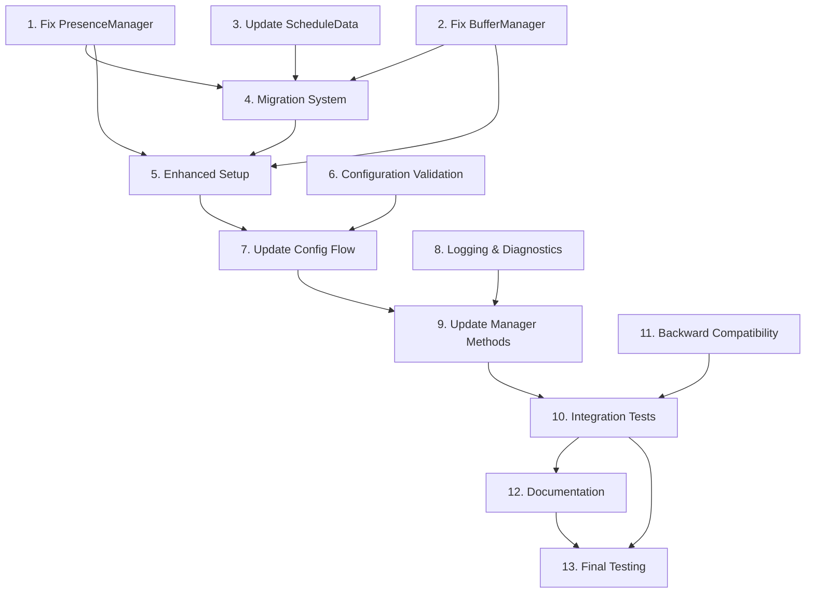

# Manager Integration Fix - Implementation Plan

Convert the manager integration fix design into a series of prompts for a code-generation LLM that will implement each step in a test-driven manner. Prioritize fixing the immediate setup error while ensuring proper storage integration and backward compatibility. Make sure that each prompt builds on the previous prompts, and ends with wiring things together. Focus ONLY on tasks that involve writing, modifying, or testing code.

## Implementation Tasks

- [x] 1. Fix PresenceManager constructor and add storage integration
  - Update `PresenceManager.__init__()` to accept `storage_service` parameter
  - Add configuration loading and saving methods to PresenceManager
  - Create `PresenceConfig` dataclass for configuration management
  - Implement default configuration initialization
  - Add comprehensive error handling for configuration operations
  - Write unit tests for PresenceManager storage integration
  - _Requirements: 1.1, 1.2, 1.3, 1.4, 1.5_

- [x] 2. Fix BufferManager constructor and add storage integration
  - Update `BufferManager.__init__()` to accept `storage_service` parameter
  - Add configuration loading and saving methods to BufferManager
  - Create enhanced `BufferConfig` dataclass for global and entity-specific settings
  - Implement default buffer configuration initialization
  - Add comprehensive error handling for buffer configuration operations
  - Write unit tests for BufferManager storage integration
  - git add and git commit
  - _Requirements: 2.1, 2.2, 2.3, 2.4, 2.5_

- [x] 3. Update ScheduleData model to include manager configurations
  - Add `presence_config` field to ScheduleData model
  - Add `buffer_config` field to ScheduleData model
  - Update model serialization/deserialization methods
  - Ensure backward compatibility with existing schedule data
  - Add validation for new configuration fields
  - Write unit tests for enhanced ScheduleData model
  - git add and git commit
  - _Requirements: 3.1, 3.4, 4.1_

- [x] 4. Implement configuration migration system
  - Create migration functions to move config entry data to storage format
  - Add version detection and migration logic for PresenceManager
  - Add version detection and migration logic for BufferManager
  - Implement automatic migration during manager initialization
  - Add migration logging and error handling
  - Write unit tests for configuration migration scenarios
  - git add and git commit
  - _Requirements: 4.1, 4.2, 4.3, 4.4_

- [x] 5. Enhance integration setup with robust error handling
  - Update `async_setup_entry` to handle manager initialization failures gracefully
  - Add fallback initialization for managers when storage fails
  - Implement comprehensive error logging and recovery
  - Add setup validation to ensure managers are properly initialized
  - Create diagnostic functions for troubleshooting setup issues
  - Write integration tests for various setup failure scenarios
  - git add and git commit
  - _Requirements: 5.1, 5.2, 5.3, 5.4, 7.1, 7.2, 7.3, 7.4_

- [x] 6. Add configuration validation and consistency checks
  - Implement configuration validation in PresenceManager
  - Implement configuration validation in BufferManager
  - Add cross-manager configuration consistency checks
  - Create configuration repair functions for common issues
  - Add validation logging and error reporting
  - Write unit tests for configuration validation scenarios
  - git add and git commit
  - _Requirements: 6.1, 6.2, 6.3, 6.4_

- [x] 7. Update config flow to work with enhanced managers
  - Modify config flow to properly initialize managers with storage
  - Update config flow to save initial configuration to storage
  - Add config flow error handling for manager initialization failures
  - Ensure config flow works with both new and existing installations
  - Add config flow validation for presence and buffer settings
  - Write unit tests for enhanced config flow functionality
  - git add and git commit
  - _Requirements: 3.1, 3.2, 7.1, 7.2_

- [x] 8. Add comprehensive logging and diagnostics
  - Add detailed logging to manager initialization processes
  - Implement diagnostic methods for configuration status reporting
  - Add performance monitoring for configuration operations
  - Create troubleshooting utilities for common configuration issues
  - Add debug logging for configuration loading and saving
  - Write unit tests for logging and diagnostic functionality
  - git add and git commit
  - _Requirements: 8.1, 8.2, 8.3, 8.4_

- [-] 9. Update existing manager methods to use stored configuration
  - Update PresenceManager methods to use and persist configuration changes
  - Update BufferManager methods to use and persist configuration changes
  - Add configuration change event emission for real-time updates
  - Ensure all configuration changes are properly saved to storage
  - Add configuration change validation and error handling
  - Write unit tests for configuration persistence in manager operations
  - git add and git commit
  - _Requirements: 1.4, 2.4, 3.3_

- [ ] 10. Create comprehensive integration tests
  - Write integration tests for complete setup flow with presence configuration
  - Test setup with various presence entity configurations
  - Test setup with custom buffer configurations
  - Test migration scenarios from existing installations
  - Test error recovery and fallback behavior
  - Validate that the original TypeError is resolved
  - git add and git commit
  - _Requirements: All requirements validation_

- [ ] 11. Add backward compatibility validation
  - Test that existing installations continue to work after upgrade
  - Validate that all existing configuration is preserved during migration
  - Test that the integration works with missing or corrupted storage
  - Ensure graceful degradation when storage operations fail
  - Validate that config entry data is still used as fallback
  - Write comprehensive backward compatibility tests
  - git add and git commit
  - _Requirements: 4.1, 4.2, 4.3, 4.4_

- [ ] 12. Update documentation and troubleshooting guides
  - Update SETUP_GUIDE.md with information about presence configuration persistence
  - Add troubleshooting section for manager initialization failures
  - Document the migration process for existing users
  - Add diagnostic procedures for configuration issues
  - Update error message documentation with new error scenarios
  - Create configuration validation and repair guides
  - git add and git commit
  - _Requirements: 8.4_

- [ ] 13. Final integration testing and validation
  - Perform end-to-end testing with real presence entities
  - Test the complete setup flow from fresh installation to operation
  - Validate that the original error is completely resolved
  - Test performance impact of storage integration
  - Perform stress testing with various configuration scenarios
  - git add and git commit to allow for rollback
  - _Requirements: All requirements final validation_

## Task Dependencies



## Critical Path

The most critical tasks to resolve the immediate error:

1. **Task 1**: Fix PresenceManager constructor (CRITICAL - resolves TypeError)
2. **Task 2**: Fix BufferManager constructor (CRITICAL - resolves TypeError)
3. **Task 5**: Enhanced setup error handling (HIGH - prevents future setup failures)
4. **Task 10**: Integration tests (HIGH - validates fix works)

## Implementation Notes

### Immediate Fix Priority
- Tasks 1-2 must be completed first to resolve the TypeError
- Task 5 should be completed early to prevent similar issues
- Other tasks can be implemented incrementally

### Error Resolution Strategy
The TypeError occurs because:
```python
# Current broken call:
presence_manager = PresenceManager(hass, storage_service)  # 3 args
buffer_manager = BufferManager(hass, storage_service)     # 3 args

# Current constructor:
def __init__(self, hass: HomeAssistant) -> None:          # expects 2 args

# Fixed constructor:
def __init__(self, hass: HomeAssistant, storage_service: StorageService) -> None:  # expects 3 args
```

### Testing Strategy
- Each task includes unit tests for the specific functionality
- Integration tests validate the complete setup flow
- Backward compatibility tests ensure existing setups continue working
- Error scenario tests validate graceful failure handling

### Rollback Safety
- Each task includes git commits for rollback points
- Configuration migration includes backup mechanisms
- Fallback behavior preserves existing functionality
- Error handling prevents complete setup failures

### Performance Considerations
- Configuration loading is done asynchronously
- Configuration is cached to avoid repeated storage access
- Storage operations are batched when possible
- Error handling doesn't significantly impact performance