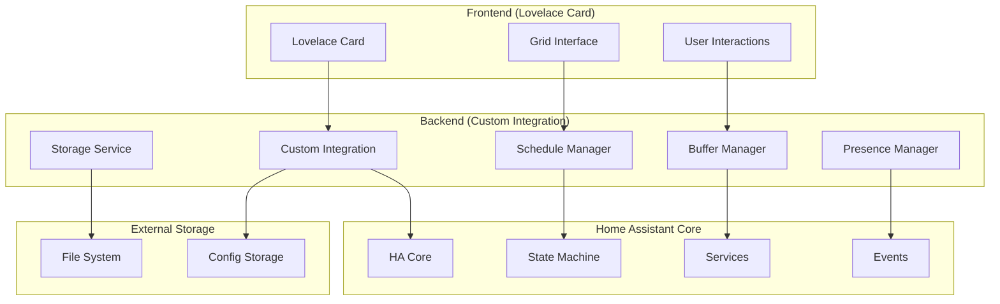

# Design Document

## Overview

The Roost Scheduler is implemented as a dual-component system: a Home Assistant custom integration (backend) and a Lovelace card (frontend). The backend handles scheduling logic, data persistence, and Home Assistant service integration, while the frontend provides an intuitive grid-based interface for schedule management.

The system follows Home Assistant's architectural patterns, using config entries for integration setup, HA storage for data persistence, and standard service/event mechanisms for communication between components.

## Architecture

### High-Level Architecture



### Component Breakdown

#### Backend Components

1. **Custom Integration (`__init__.py`)**
   - Entry point for the integration
   - Manages component lifecycle
   - Registers services and platforms

2. **Config Flow (`config_flow.py`)**
   - Handles initial setup and onboarding
   - Entity selection and configuration
   - Lovelace card installation option

3. **Schedule Manager (`schedule_manager.py`)**
   - Core scheduling logic
   - Schedule evaluation and execution
   - Time slot management

4. **Buffer Manager (`buffer_manager.py`)**
   - Implements intelligent buffering algorithm
   - Tracks manual changes and timing
   - Manages per-slot overrides

5. **Presence Manager (`presence_manager.py`)**
   - Evaluates Home/Away status
   - Handles presence entity monitoring
   - Manages timeout and override logic

6. **Storage Service (`storage.py`)**
   - Data persistence using HA storage
   - Export/import functionality
   - Backup management

#### Frontend Components

1. **Lovelace Card (`roost-scheduler-card.js`)**
   - Main card implementation
   - Grid rendering and interaction
   - Real-time state synchronization

2. **Grid Component (`grid-component.js`)**
   - Visual grid interface
   - Click-and-drag functionality
   - Time slot visualization

3. **Configuration Panel (`config-panel.js`)**
   - Card configuration interface
   - Entity selection
   - Display options

## Components and Interfaces

### Backend Interfaces

#### Schedule Manager Interface

```python
class ScheduleManager:
    async def evaluate_current_slot(self, entity_id: str, mode: str) -> ScheduleSlot | None
    async def apply_schedule(self, entity_id: str, force: bool = False) -> bool
    async def update_slot(self, entity_id: str, day: str, time: str, target: dict) -> None
    async def get_schedule_grid(self, entity_id: str, mode: str) -> dict
```

#### Buffer Manager Interface

```python
class BufferManager:
    def should_suppress_change(self, entity_id: str, target_value: float, 
                              slot_config: dict) -> bool
    def update_manual_change(self, entity_id: str, value: float) -> None
    def get_buffer_config(self, slot_config: dict) -> BufferConfig
```

#### Presence Manager Interface

```python
class PresenceManager:
    async def get_current_mode(self) -> str  # "home" or "away"
    async def evaluate_presence_entities(self) -> bool
    def is_entity_stale(self, entity_id: str) -> bool
    async def register_mode_change_callback(self, callback: Callable) -> None
```

#### Storage Service Interface

```python
class StorageService:
    async def load_schedules(self) -> dict
    async def save_schedules(self, schedules: dict) -> None
    async def export_backup(self, path: str) -> str
    async def import_backup(self, file_path: str) -> bool
    async def create_nightly_backup(self) -> None
```

### Frontend Interfaces

#### Card-Backend Communication

The Lovelace card communicates with the backend through:

1. **WebSocket API** - Real-time state updates
2. **REST API** - Schedule CRUD operations  
3. **Service Calls** - Immediate actions (apply_slot, force_apply)
4. **Events** - Presence changes, schedule updates

#### Grid Interface Events

```javascript
// Grid interaction events
gridComponent.addEventListener('slot-click', (event) => {
    const { day, time, currentValue } = event.detail;
    // Handle slot selection
});

gridComponent.addEventListener('slot-drag', (event) => {
    const { startSlot, endSlot, value } = event.detail;
    // Handle multi-slot selection
});

gridComponent.addEventListener('value-change', (event) => {
    const { slots, newValue } = event.detail;
    // Update backend with new schedule values
});
```

## Data Models

### Schedule Data Structure

```json
{
  "version": "0.3.0",
  "entities_tracked": ["climate.living_room", "climate.bedroom"],
  "presence_entities": ["device_tracker.phone", "input_boolean.vacation"],
  "presence_rule": "anyone_home",
  "presence_timeout_seconds": 600,
  "buffer": {
    "global": {
      "time_minutes": 15,
      "value_delta": 2.0,
      "apply_to": "climate"
    }
  },
  "ui": {
    "resolution_minutes": 30,
    "auto_add_card": false
  },
  "schedules": {
    "home": {
      "monday": [
        {
          "start": "06:00",
          "end": "08:30", 
          "target": {
            "domain": "climate",
            "temperature": 20.0
          },
          "buffer_override": {
            "time_minutes": 10,
            "value_delta": 1.0
          }
        }
      ]
    },
    "away": {
      "monday": [
        {
          "start": "08:30",
          "end": "18:00",
          "target": {
            "domain": "climate", 
            "temperature": 16.0
          }
        }
      ]
    }
  },
  "metadata": {
    "created_by": "config_flow",
    "created_at": "2025-09-16T12:00:00Z",
    "last_modified": "2025-09-16T14:30:00Z"
  }
}
```

### Entity State Tracking

```python
@dataclass
class EntityState:
    entity_id: str
    current_value: float
    last_manual_change: datetime
    last_scheduled_change: datetime
    buffer_config: BufferConfig
    
@dataclass 
class BufferConfig:
    time_minutes: int
    value_delta: float
    enabled: bool
```

### Schedule Slot Model

```python
@dataclass
class ScheduleSlot:
    day: str  # monday, tuesday, etc.
    start_time: str  # "06:00"
    end_time: str   # "08:30"
    target_value: float
    entity_domain: str
    buffer_override: BufferConfig | None = None
```

## Error Handling

### Backend Error Handling

1. **Storage Errors**
   - Corrupted storage files → Attempt recovery from backup
   - Missing storage → Initialize with defaults
   - Write failures → Retry with exponential backoff

2. **Entity Errors**
   - Unavailable entities → Log warning, skip schedule application
   - Invalid target values → Clamp to entity's min/max range
   - Service call failures → Retry up to 3 times with delay

3. **Presence Evaluation Errors**
   - Stale presence entities → Use timeout logic
   - Template evaluation errors → Fall back to default rule
   - Override entity unavailable → Ignore override

### Frontend Error Handling

1. **Connection Errors**
   - WebSocket disconnection → Show offline indicator, attempt reconnection
   - API call failures → Display error message, provide retry button
   - Timeout errors → Show loading state with cancel option

2. **Data Validation Errors**
   - Invalid schedule data → Highlight problematic slots, prevent save
   - Out-of-range values → Show validation message, suggest valid range
   - Conflicting slots → Highlight conflicts, require resolution

3. **UI Errors**
   - Grid rendering failures → Fall back to list view
   - Interaction errors → Reset to last known good state
   - Configuration errors → Show setup wizard

## Testing Strategy

### Backend Testing

#### Unit Tests

1. **Schedule Manager Tests**
   - Schedule evaluation logic
   - Time slot calculations
   - Edge cases (midnight crossover, DST changes)

2. **Buffer Manager Tests**
   - Suppression algorithm accuracy
   - Manual change tracking
   - Per-slot override behavior

3. **Presence Manager Tests**
   - Presence rule evaluation
   - Timeout handling
   - Override logic

4. **Storage Service Tests**
   - Data persistence integrity
   - Export/import functionality
   - Backup creation and restoration

#### Integration Tests

1. **Config Flow Tests**
   - Complete onboarding flow
   - Entity validation
   - Card installation process

2. **Service Tests**
   - Service registration and calls
   - Parameter validation
   - Error handling

3. **Event Handling Tests**
   - State change responses
   - Presence change handling
   - Schedule trigger accuracy

### Frontend Testing

#### Unit Tests

1. **Grid Component Tests**
   - Rendering accuracy
   - Interaction handling
   - State synchronization

2. **Configuration Tests**
   - Validation logic
   - Default value handling
   - Error display

#### Integration Tests

1. **Card Integration Tests**
   - Backend communication
   - Real-time updates
   - Error recovery

2. **User Interaction Tests**
   - Complete workflow testing
   - Multi-entity scenarios
   - Performance under load

### End-to-End Testing

1. **Complete User Workflows**
   - Installation through HACS
   - Initial setup and onboarding
   - Schedule creation and modification
   - Presence-based mode switching
   - Manual override scenarios

2. **Performance Testing**
   - Large schedule datasets
   - Multiple concurrent users
   - Memory usage over time

3. **Compatibility Testing**
   - Different Home Assistant versions
   - Various browser environments
   - Mobile device responsiveness